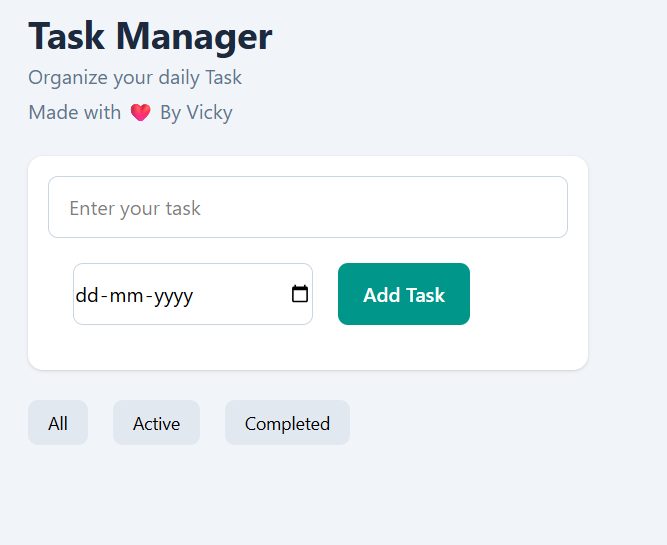
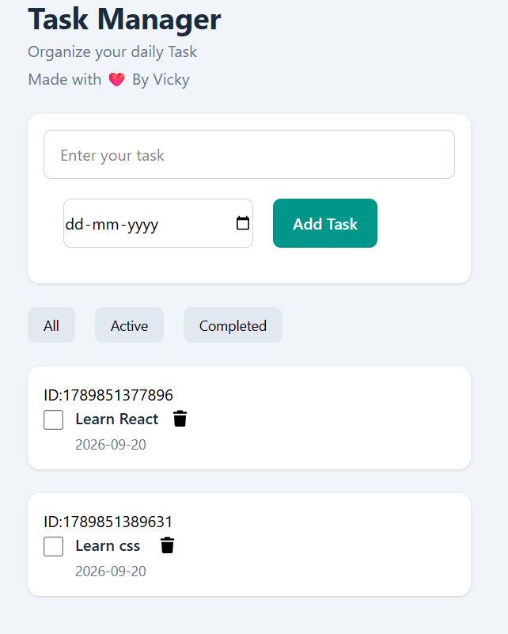
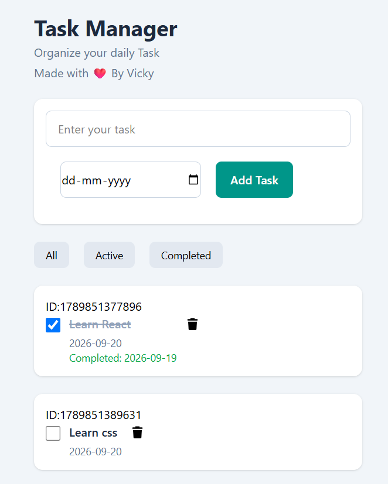

# 📝 React Task Manager

A simple and responsive **Task Manager** built with **React.js** and **Tailwind CSS**.

This project allows users to create tasks, set an added date, mark tasks as completed, automatically store the completed date, delete tasks, filter tasks, and save tasks in the browser using **Local Storage**.


## 📸 Preview





## ✨ Features

* ➕ Add new tasks
* 📅 Set task added date
* ✅ Mark tasks as completed
* 📅 Automatically save completed date
* 🗑️ Delete tasks
* 🔍 Filter tasks

  * All
  * Active
  * Completed
* 💾 Save tasks using Browser Local Storage
* 📱 Mobile responsive design
* 🎨 Styled with Tailwind CSS
* ⚡ Built with React and Vite

## 🛠️ Technologies Used

* **React.js**
* **JavaScript**
* **Tailwind CSS**
* **Vite**
* **HTML5**
* **Local Storage**
* **Git & GitHub**

## 📂 Project Structure

```text
task-manager/
│
├── public/
│
├── src/
│   ├── assets/
│   │   └── preview.png
│   │
│   ├── App.jsx
│   ├── index.css
│   └── main.jsx
│
├── .gitignore
├── index.html
├── package.json
├── package-lock.json
├── vite.config.js
└── README.md
```

## 📋 How It Works

### 1. Add a Task

Enter the task name and select a date.

```text
Task: Learn React
Date: 2026-09-20
```

Click **Add Task** to add it to the task list.

### 2. Complete a Task

Click the checkbox beside a task.

The task will be marked as completed and the current date will automatically be stored as the **Completed Date**.

### 3. Delete a Task

Click the delete button to remove a task from the list.

### 4. Filter Tasks

Tasks can be filtered using:

```text
All → Shows all tasks
Active → Shows unfinished tasks
Completed → Shows completed tasks
```

### 5. Local Storage

Tasks are saved in the browser using `localStorage`.

This means tasks remain available even after refreshing or reopening the browser.

## 💾 Local Storage

The project uses:

```javascript
localStorage.setItem(
  "tasks",
  JSON.stringify(tasks)
);
```

When the application starts, the saved tasks are retrieved using:

```javascript
const savedTasks = localStorage.getItem("tasks");

JSON.parse(savedTasks);
```

## ⚙️ Installation

Clone the repository:

```bash
git clone https://github.com/YOUR-USERNAME/task-manager.git
```

Go into the project folder:

```bash
cd task-manager
```

Install dependencies:

```bash
npm install
```

Start the development server:

```bash
npm run dev
```

Open the local development URL shown in your terminal.

## 📱 Responsive Design

The application is designed to work across different screen sizes:

* 📱 Mobile
* 📱 Tablet
* 💻 Desktop

Tailwind CSS responsive utilities are used to create the responsive layout.

## 🎯 What I Learned

Through this project, I practiced:

* React `useState`
* React `useEffect`
* JSX
* Event handling
* Controlled inputs
* JavaScript objects and arrays
* `map()`
* `filter()`
* Spread operator
* Conditional rendering
* Local Storage
* Date handling
* Tailwind CSS
* Responsive design

## 🔮 Future Improvements

Possible future features:

* ✏️ Edit tasks
* 🔔 Task reminders
* ⭐ Task priority
* 🏷️ Task categories
* 🔎 Search tasks
* 🌙 Dark mode
* 📊 Task statistics
* ☁️ Database storage
* 🔐 User authentication

## 👨‍💻 Author

**Laxmidhar Jena**

GitHub: [@laxmidharvicky-tech](https://github.com/laxmidharvicky-tech)

## 📄 License

This project is licensed under the **MIT License**.
